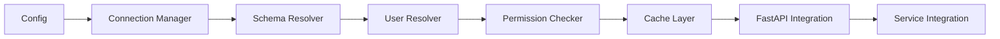

# Neo-Commons Implementation Roadmap

## Executive Summary

This roadmap provides a phased approach to implementing the neo-commons library based on our comprehensive planning. The implementation follows a dependency-driven approach, ensuring each component builds upon stable foundations.

## Implementation Phases Overview

```
Phase 1: Core Infrastructure (Week 1-2)
  - Project Setup & Configuration
  - Database Connection Manager
  - Basic Error Handling

Phase 2: Authentication Foundation (Week 3-4)
  - User Identity Resolution
  - Keycloak Integration
  - JWT Validation

Phase 3: Permission System (Week 5-6)
  - Permission Checker
  - Role Management
  - Redis Caching Layer

Phase 4: Service Integration (Week 7-8)
  - FastAPI Middleware
  - Dependency Injection
  - Repository Pattern

Phase 5: Production Readiness (Week 9-10)
  - Performance Optimization
  - Monitoring & Metrics
  - Documentation & Testing
```

## Phase 1: Core Infrastructure (Weeks 1-2)

### Week 1: Project Foundation

**Setup neo-commons package structure:**
```bash
neo-commons/
├── src/
│   └── neo_commons/
│       ├── __init__.py
│       ├── config/
│       │   ├── __init__.py
│       │   ├── settings.py
│       │   └── constants.py
│       ├── core/
│       │   ├── __init__.py
│       │   ├── exceptions.py
│       │   └── protocols.py
│       └── utils/
│           ├── __init__.py
│           ├── uuid.py
│           └── datetime.py
├── tests/
├── pyproject.toml
└── README.md
```

**Core Configuration (`config/settings.py`):**
```python
from pydantic import BaseSettings
from typing import Optional

class GlobalSettings(BaseSettings):
    # Database
    ADMIN_DATABASE_URL: str
    DB_ENCRYPTION_KEY: str
    DB_POOL_MIN_SIZE: int = 5
    DB_POOL_MAX_SIZE: int = 20
    
    # Redis
    REDIS_URL: str = "redis://localhost:6379"
    CACHE_TTL_DEFAULT: int = 300
    
    # Auth
    JWT_SECRET_KEY: str
    JWT_ALGORITHM: str = "RS256"
    
    class Config:
        env_file = ".env"
```

**Tasks:**
- [ ] Initialize package structure
- [ ] Setup pyproject.toml with dependencies
- [ ] Create base exception hierarchy
- [ ] Implement UUIDv7 generator
- [ ] Add timezone utilities
- [ ] Setup pytest framework
- [ ] Create CI/CD pipeline

### Week 2: Database Connection Management

**Implement Dynamic Connection Manager:**
```python
# infrastructure/database/connection_manager.py
class DynamicConnectionManager:
    async def initialize(self)
    async def get_connection(self, name: str) -> Pool
    async def get_connection_for_tenant(self, tenant_id: str) -> Pool
    async def _load_configurations(self)
    async def _create_pool(self, config: ConnectionConfig) -> Pool
```

**Tasks:**
- [ ] Implement ConnectionConfig dataclass
- [ ] Create DynamicConnectionManager
- [ ] Add connection pool management
- [ ] Implement health monitoring
- [ ] Add failover strategy
- [ ] Create encryption helper for passwords
- [ ] Write unit tests
- [ ] Add integration tests with test database

## Phase 2: Authentication Foundation (Weeks 3-4)

### Week 3: User Identity & Keycloak

**User Identity Resolution:**
```python
# auth/identity/resolver.py
class UserIdentityResolver:
    async def resolve_user(self, identifier: str, tenant_id: Optional[str])
    async def create_or_update_user(self, keycloak_user: dict, tenant_id: str)
    async def map_external_to_platform(self, external_id: str) -> str
```

**Keycloak Integration:**
```python
# auth/keycloak/client.py
class KeycloakClient:
    async def validate_token(self, token: str) -> dict
    async def get_realm_public_key(self, realm: str) -> str
    async def get_admin_token(self) -> str  # OAuth2 client credentials
```

**Tasks:**
- [ ] Create UserIdentity dataclass
- [ ] Implement UserIdentityResolver
- [ ] Add Keycloak client with OAuth2
- [ ] Implement JWT validation
- [ ] Add public key caching
- [ ] Create user synchronization logic
- [ ] Write comprehensive tests
- [ ] Document authentication flow

### Week 4: Schema Resolution & Context

**Schema Resolution:**
```python
# auth/schema/resolver.py
class SchemaResolver:
    async def resolve_schema(self, context: RequestContext) -> str
    async def get_tenant_schema(self, tenant_id: str) -> str
    def validate_schema_name(self, schema_name: str) -> str
```

**Request Context:**
```python
# auth/context.py
@dataclass
class RequestContext:
    user_id: Optional[str]
    tenant_id: Optional[str]
    schema_name: str
    is_admin_request: bool
    permissions: Set[str]
```

**Tasks:**
- [ ] Implement SchemaResolver
- [ ] Add SQL injection prevention
- [ ] Create RequestContext model
- [ ] Add context extraction middleware
- [ ] Implement schema caching
- [ ] Write security tests
- [ ] Performance benchmarking

## Phase 3: Permission System (Weeks 5-6)

### Week 5: Permission Checking

**Permission Checker Implementation:**
```python
# auth/permissions/checker.py
class PermissionChecker:
    async def check_permission(self, user_id: str, permission: str, scope: dict)
    async def check_multiple(self, user_id: str, permissions: List[str])
    async def get_all_permissions(self, user_id: str, scope: dict)
```

**Tasks:**
- [ ] Implement core permission checker
- [ ] Add role-based permission loading
- [ ] Add direct permission loading
- [ ] Add team-based permission loading
- [ ] Implement permission caching
- [ ] Create permission invalidation logic
- [ ] Write permission tests
- [ ] Load testing for performance

### Week 6: Redis Caching Layer

**Cache Implementation:**
```python
# infrastructure/cache/redis_cache.py
class TenantAwareCache:
    async def get(self, key: str, tenant_id: Optional[str])
    async def set(self, key: str, value: Any, ttl: int, tenant_id: Optional[str])
    async def invalidate_pattern(self, pattern: str, tenant_id: Optional[str])
```

**Tasks:**
- [ ] Setup Redis connection pool
- [ ] Implement tenant-aware caching
- [ ] Add cache invalidation strategies
- [ ] Create cache warming logic
- [ ] Implement distributed locking
- [ ] Add cache metrics
- [ ] Performance testing
- [ ] Document caching patterns

## Phase 4: Service Integration (Weeks 7-8)

### Week 7: FastAPI Integration

**Middleware Stack:**
```python
# interfaces/fastapi/middleware.py
class TenantContextMiddleware:
    async def __call__(self, request: Request, call_next)

class AuthenticationMiddleware:
    async def __call__(self, request: Request, call_next)
```

**Dependency Injection:**
```python
# interfaces/fastapi/dependencies.py
class CheckPermission:
    def __init__(self, permissions: List[str])
    async def __call__(self, request: Request, token: str)

async def get_db_connection(request: Request) -> Connection
async def get_current_user(token: str = Depends(oauth2_scheme))
```

**Tasks:**
- [ ] Create middleware stack
- [ ] Implement CheckPermission dependency
- [ ] Add database connection dependency
- [ ] Create user context dependency
- [ ] Add error handlers
- [ ] Write integration tests
- [ ] Create example API endpoints
- [ ] Document usage patterns

### Week 8: Repository Pattern

**Unified Repository:**
```python
# repositories/base.py
class UnifiedRepository:
    async def get_by_id(self, id: str, schema: str)
    async def list(self, filters: dict, schema: str)
    async def create(self, data: dict, schema: str)
    async def update(self, id: str, data: dict, schema: str)
    async def delete(self, id: str, schema: str)
```

**Tasks:**
- [ ] Create base repository class
- [ ] Implement UserRepository
- [ ] Implement RoleRepository
- [ ] Implement PermissionRepository
- [ ] Add transaction support
- [ ] Create repository factory
- [ ] Write repository tests
- [ ] Performance optimization

## Phase 5: Production Readiness (Weeks 9-10)

### Week 9: Performance & Monitoring

**Metrics Collection:**
```python
# monitoring/metrics.py
class MetricsCollector:
    def record_request(self, endpoint: str, duration: float)
    def record_cache_hit(self, cache_type: str)
    def record_db_query(self, query_type: str, duration: float)
```

**Tasks:**
- [ ] Implement metrics collection
- [ ] Add Prometheus integration
- [ ] Create health check endpoints
- [ ] Add distributed tracing
- [ ] Implement rate limiting
- [ ] Performance profiling
- [ ] Load testing (10K req/sec target)
- [ ] Create monitoring dashboard

### Week 10: Documentation & Polish

**Documentation Requirements:**
- API reference documentation
- Integration guides for each service
- Architecture decision records
- Performance tuning guide
- Security best practices
- Migration guide from existing system

**Tasks:**
- [ ] Write comprehensive README
- [ ] Create API documentation
- [ ] Write integration guides
- [ ] Document security practices
- [ ] Create migration scripts
- [ ] Final security audit
- [ ] Performance validation
- [ ] Release preparation

## Service Integration Timeline

### NeoAdminApi Integration (Week 11)
```python
# Example integration
from neo_commons import NeoCommonsApp

app = NeoCommonsApp(
    service_name="NeoAdminApi",
    config_overrides={"database": {"default_schema": "admin"}}
)
fastapi_app = app.create_fastapi_app()
```

### NeoTenantApi Integration (Week 12)
```python
# Example integration
from neo_commons import NeoCommonsApp

app = NeoCommonsApp(
    service_name="NeoTenantApi",
    config_overrides={"auth": {"multi_tenant": True}}
)
fastapi_app = app.create_fastapi_app()
```

## Critical Path Dependencies



## Risk Mitigation

| Risk | Impact | Mitigation Strategy |
|------|--------|-------------------|
| Schema name SQL injection | Critical | Regex validation + whitelist |
| Connection pool exhaustion | High | Dynamic sizing + monitoring |
| Cache inconsistency | Medium | TTL + event invalidation |
| Performance degradation | High | Profiling + load testing |
| Keycloak downtime | High | Token caching + fallback |

## Success Metrics

### Performance Targets
- Permission check: <1ms (cached)
- User resolution: <5ms (cached)
- Database connection: <50ms
- Cache hit rate: >90%
- API p95 latency: <100ms

### Quality Targets
- Test coverage: >90%
- Documentation coverage: 100%
- Security scan: 0 critical issues
- Load capacity: 10K req/sec/instance

## Testing Strategy

### Unit Tests (Week 1-8)
- Each component tested in isolation
- Mock external dependencies
- Target: >95% coverage

### Integration Tests (Week 4-8)
- Test component interactions
- Use test database and Redis
- Target: >85% coverage

### Load Tests (Week 9)
- Simulate 10K concurrent users
- Test failover scenarios
- Measure performance targets

### Security Tests (Week 10)
- SQL injection testing
- Token validation testing
- Permission bypass attempts
- Rate limiting validation

## Deliverables Checklist

### Code Deliverables
- [ ] neo-commons package
- [ ] Comprehensive test suite
- [ ] Performance benchmarks
- [ ] Migration scripts

### Documentation Deliverables
- [ ] API reference
- [ ] Integration guides
- [ ] Architecture documentation
- [ ] Security guidelines

### Operational Deliverables
- [ ] Monitoring dashboards
- [ ] Deployment scripts
- [ ] CI/CD pipeline
- [ ] Health check endpoints

## Post-Implementation Plan

### Month 2: Optimization
- Performance tuning based on production metrics
- Cache strategy refinement
- Connection pool optimization

### Month 3: Enhancement
- Additional auth providers
- Advanced permission features
- Multi-region optimization

### Month 4: Scale
- Horizontal scaling validation
- Disaster recovery testing
- Enterprise feature additions

## Conclusion

This roadmap provides a systematic approach to implementing neo-commons with:
- **Clear dependencies** between components
- **Testable milestones** for each phase
- **Risk mitigation** built into the plan
- **Performance validation** throughout
- **Production readiness** as the goal

Following this roadmap will deliver a robust, scalable, and secure shared library that serves as the foundation for all NeoMultiTenant services.